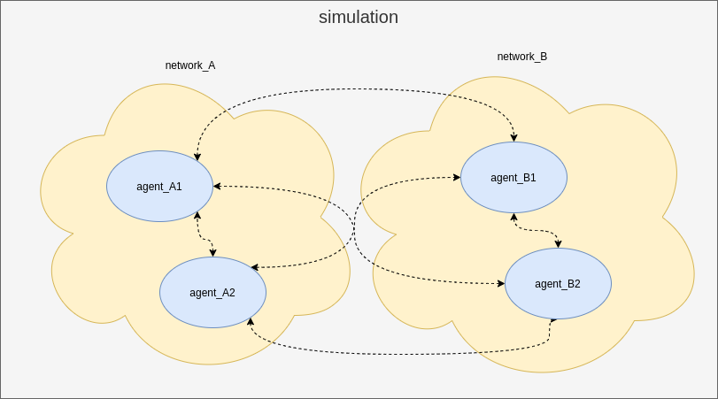
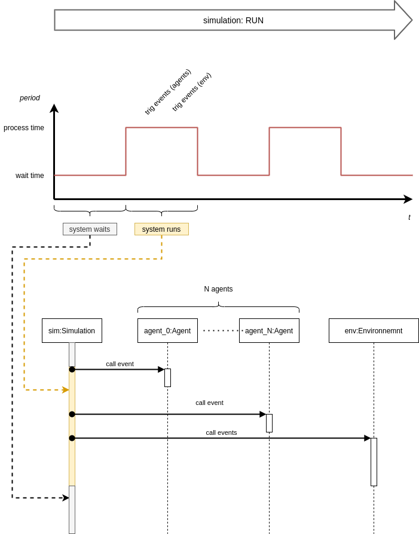
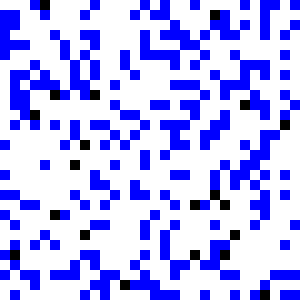

# py_light_mas 


- [py_light_mas](#py_light_mas)
  - [architecture](#architecture)
    - [relation](#relation)
    - [sequence](#sequence)
  - [use lib](#use-lib)
    - [create simulation](#create-simulation)
    - [create environnment](#create-environnment)
    - [create agent](#create-agent)
    - [create a network](#create-a-network)
    - [run simulation](#run-simulation)
  - [examples](#examples)
    - [car ./examples/horse/](#car-exampleshorse)
    - [robot ./examples/robot/](#robot-examplesrobot)

## architecture 

### relation



### sequence



## use lib 

### create simulation 

create a new child class of **Simulation**

```python
class YourSimulation(Simulation):
    def __init__(self, ..., **kargs):
        super(YourSimulation, self).__init__(**kargs)
        # create your env and agents here 
        (...)
```

:warning: all agents need to be declared after this call `super(YourSimulation, self).__init__(**kargs)`, during the parent init call Agent class and informe who is the simulation. 


### create environnment 

create a new child class of **Environnemnt**


``` python 
class YourEnvironnement(Environnemnt):
    
    def __init__(self,...,**kargs):
        super(YourEnvironnement,self).__init__(**kargs)

    def on_event_new_tick(self):
        (...)

    def on_event_show(self):
        (...)
```

For the moment, Environnement doesn't have a constructor, so use init with **kwargs is useless, but if Environnemnt evolves and need parameters your code still working. 

### create agent 

create a new child class of **Agent**

``` python 
class YourAgent(Agent): 

    def __init__(self,...,**kargs):
        super(YourAgent,self).__init__(**kargs)

    def on_event_new_message(self,message): 
        (...)

    def on_event_new_signal(self,message): 
        (...)

    def on_event_new_tick(self,env):
        (...)
``` 

### create a network 

you can create a network where do you want 

```python 
network = Network("localhost")
```

if you want to connect an agent to your network 
```python 
agent = YourAgent("agent1")
agent.connect(network)
```

### run simulation 

```python
sim = YourSimulation(...)
# if you want to manage by yourself the loop run 
while(True): 
    (...)
    sim.run() 
    (...)
# if you want to call loop run already implemented 
sim.run_loop()
```

## examples 

:warning: examples use pygame=1.9.6

### car [./examples/horse/](./examples/horse/) 


### robot [./examples/robot/](./examples/robot/) 

