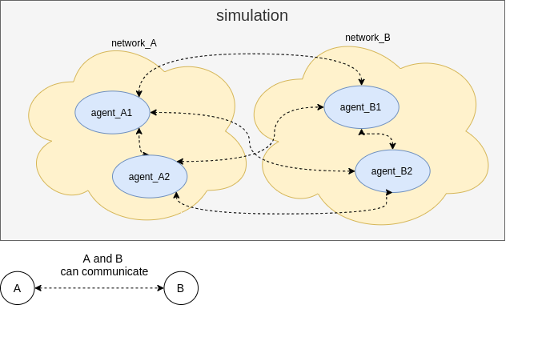

# py_light_mas 


## architecture 




### agent 

create a new child class of **Agent**

you should override some event methods: 
```python 
on_event_new_message(self,message)
on_event_new_signal(self,message)
on_event_new_tick(self,env)
```


## examples 

### car [./examples/car/](./examples/car/) 

